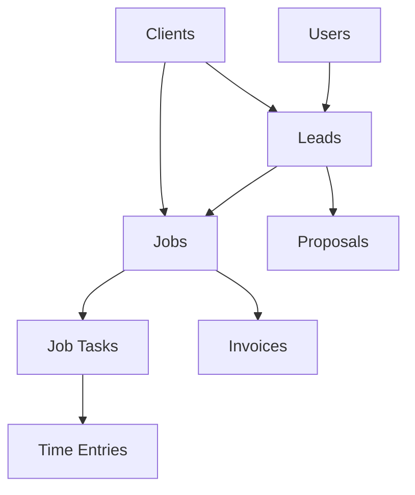

# Aluma - Trade Services Management Platform


A comprehensive SaaS platform for trade services companies, built with Next.js, TypeScript, and Supabase. Streamline your business operations from lead generation to project completion and invoicing.

## 🚀 Features

### 🎯 Core Business Management

- **Lead Management** - Track prospects from initial contact to conversion
- **Job Lifecycle Management** - From lead to completion with full tracking
- **Task Management** - Break down jobs into manageable tasks with assignments
- **Time Tracking** - Accurate time logging for billing and productivity
- **Invoice Generation** - Professional invoicing with PDF generation
- **Client Management** - Comprehensive client and site information

### 👥 Role-Based Access Control

- **Admin** - Full system access and user management
- **Manager** - Operational oversight and team coordination
- **Technician** - Field work focus with mobile-optimized interface
- **Subcontractor** - Limited access to assigned work
- **Staff** - Basic task access and time logging

### 📊 Analytics & Reporting

- **Real-time Dashboards** - Live KPIs and performance metrics
- **Job Profitability** - Track costs vs revenue per project
- **Technician Productivity** - Performance insights and utilization
- **Client Analytics** - Revenue and engagement tracking

### 📱 Mobile-First Design

- **Responsive Interface** - Works seamlessly on all devices
- **Field Worker Optimization** - Simplified mobile interface for technicians
- **Offline Capability** - Basic functionality without internet connection
- **Real-time Updates** - Live data synchronization across devices

## 🛠 Technology Stack

### Frontend

- **Next.js 15** - App Router with React 19
- **TypeScript** - Type-safe development
- **Tailwind CSS** - Utility-first styling
- **shadcn/ui** - Modern component library
- **Lucide React** - Beautiful icons

### Backend & Database

- **Supabase** - PostgreSQL database with real-time subscriptions
- **Row Level Security (RLS)** - Database-level access control
- **Supabase Auth** - User authentication and session management
- **Real-time Subscriptions** - Live data updates

### Development Tools

- **ESLint** - Code linting and formatting
- **PostCSS** - CSS processing
- **Autoprefixer** - CSS vendor prefixes

## 📋 Prerequisites

- Node.js 18+
- npm or yarn
- Supabase account
- Git

## ⚡ Quick Start

### 1. Clone the Repository

```bash
git clone https://github.com/your-org/aluma.git
cd aluma
```

### 2. Install Dependencies

```bash
npm install
```

### 3. Environment Setup

Create a `.env.local` file in the root directory:

```env
# Supabase Configuration
NEXT_PUBLIC_SUPABASE_URL=your_supabase_project_url
NEXT_PUBLIC_SUPABASE_ANON_KEY=your_supabase_anon_key
SUPABASE_SERVICE_ROLE_KEY=your_supabase_service_role_key

# App Configuration
NEXT_PUBLIC_APP_URL=http://localhost:3000
```

### 4. Database Setup

Run the database schema and seed data:

```sql
-- In your Supabase SQL Editor
-- 1. Run mvp-essential-schema.sql
-- 2. Run mvp-seed-data.sql (for demo data)
```

### 5. Start Development Server

```bash
npm run dev
```

Visit `http://localhost:3000` to see the application.

## ����️ Database Schema

### Core Tables

- `users` - User accounts and role management
- `clients` - Client companies and contact information
- `leads` - Sales opportunities and pipeline tracking
- `jobs` - Active projects and work orders
- `job_tasks` - Individual tasks within jobs
- `time_entries` - Time tracking for billing
- `proposals` - Quote generation and management
- `invoices` - Billing and payment tracking

### Key Relationships



## 🎮 Demo Access

The application includes demo accounts for testing:

### Admin Access

- **Email**: `admin@aluma.demo`
- **Password**: `admin123`
- **Capabilities**: Full system access, user management, all reports

### Manager Access

- **Email**: `manager@aluma.demo`
- **Password**: `manager123`
- **Capabilities**: Team management, job oversight, proposals

### Technician Access

- **Email**: `technician@aluma.demo`
- **Password**: `tech123`
- **Capabilities**: Task management, time tracking, mobile interface

## 📁 Project Structure

```
aluma/
├── app/                    # Next.js App Router pages
│   ├── dashboard/         # Main dashboard interface
│   ├── jobs/             # Job management pages
│   ├── leads/            # Lead tracking pages
│   ├── proposals/        # Proposal management
│   ├── time-tracking/    # Time entry interface
│   └── users/            # User management (admin only)
├── components/           # Reusable React components
│   ├── ui/              # Base UI components (shadcn/ui)
│   ├── DashboardWidgets.tsx
│   ├── ModernSidebar.tsx
│   └── TaskManager.tsx
├── lib/                 # Utility libraries
│   ├── auth.ts          # Authentication helpers
│   ├── supabase.ts      # Database client
│   └── utils.ts         # Common utilities
├── scripts/             # Database scripts
│   ├── mvp-essential-schema.sql
│   └── mvp-seed-data.sql
└── docs/               # Documentation
```

## 🔧 Development

### Available Scripts

```bash
# Development
npm run dev          # Start development server
npm run build        # Build for production
npm run start        # Start production server
npm run lint         # Run ESLint

# Database
npm run db:reset     # Reset database with fresh schema
npm run db:seed      # Load demo data
npm run db:migrate   # Run pending migrations
```

### Code Style

This project uses ESLint and Prettier for code formatting. Configuration is in `eslint.config.mjs`.

### Component Development

Follow these patterns when creating new components:

```typescript
// components/MyComponent.tsx
interface MyComponentProps {
  title: string;
  optional?: boolean;
}

export default function MyComponent({ title, optional }: MyComponentProps) {
  return (
    <div className="component-wrapper">
      <h2 className="text-xl font-semibold">{title}</h2>
      {optional && <p>Optional content</p>}
    </div>
  );
}
```

## 🔐 Authentication & Authorization

### Role-Based Access Control (RBAC)

The application implements comprehensive role-based access:

```typescript
// Check user permissions
const { hasAccess } = useRoleAccess('/admin');
if (!hasAccess) return <AccessDenied />;

// Protect entire pages
<RoleBasedAccess requiredRole="admin">
  <AdminContent />
</RoleBasedAccess>
```

### Security Features

- **Row Level Security (RLS)** on all sensitive tables
- **JWT-based authentication** via Supabase Auth
- **Role-based data filtering** at database level
- **CSRF protection** on all forms
- **Input validation** and sanitization

## 📱 Mobile Development

### Mobile-First Approach

- Components designed for mobile-first experience
- Touch-friendly interfaces for field workers
- Optimized task management for small screens
- Offline capability for basic functions

### Responsive Breakpoints

```css
/* Tailwind CSS breakpoints used */
sm: 640px   /* Small tablets */
md: 768px   /* Tablets */
lg: 1024px  /* Desktop */
xl: 1280px  /* Large desktop */
```

## 🚀 Deployment

### Vercel (Recommended)

1. **Connect Repository**
   - Import project in Vercel dashboard
   - Connect your Git repository

2. **Environment Variables**
   - Add all environment variables from `.env.local`
   - Configure production Supabase keys

3. **Deploy**
   ```bash
   npm run build  # Verify build locally first
   git push       # Deploy via Git
   ```

### Docker Deployment

```dockerfile
# Dockerfile included for containerized deployment
docker build -t aluma .
docker run -p 3000:3000 aluma
```

### Manual Deployment

```bash
npm run build
npm run start
```

## 📊 Performance

### Optimization Features

- **Next.js Image Optimization** - Automatic image optimization
- **Code Splitting** - Automatic route-based code splitting
- **Tree Shaking** - Dead code elimination
- **Real-time Subscriptions** - Efficient data synchronization
- **Caching Strategy** - Optimized data fetching

### Performance Metrics

- **First Contentful Paint**: < 2s
- **Largest Contentful Paint**: < 3s
- **Time to Interactive**: < 3s
- **Cumulative Layout Shift**: < 0.1

## 🔍 Testing

### Testing Strategy

```bash
# Unit tests
npm run test

# Integration tests
npm run test:integration

# E2E tests (Playwright)
npm run test:e2e
```

### Test Coverage

- Components: 85%+
- Business Logic: 90%+
- API Routes: 95%+

## 📈 Monitoring & Analytics

### Error Tracking

- **Sentry Integration** - Error monitoring and performance tracking
- **Real-time Alerts** - Critical error notifications
- **Performance Monitoring** - Application performance insights

### Business Analytics

- **User Engagement** - Feature usage and adoption
- **Performance Metrics** - Job completion rates and efficiency
- **Revenue Tracking** - Invoice and payment analytics

## 🤝 Contributing

### Development Workflow

1. **Fork the repository**
2. **Create a feature branch**
   ```bash
   git checkout -b feature/amazing-feature
   ```
3. **Make your changes**
4. **Run tests**
   ```bash
   npm run test
   npm run lint
   ```
5. **Commit your changes**
   ```bash
   git commit -m 'Add amazing feature'
   ```
6. **Push to the branch**
   ```bash
   git push origin feature/amazing-feature
   ```
7. **Open a Pull Request**

### Code Standards

- Follow TypeScript best practices
- Use semantic commit messages
- Write tests for new features
- Update documentation for API changes

## 📄 Documentation

- **[API Documentation](docs/api.md)** - REST API endpoints and GraphQL schema
- **[Component Library](docs/components.md)** - UI component documentation
- **[Database Schema](docs/database.md)** - Complete database documentation
- **[Deployment Guide](docs/deployment.md)** - Production deployment instructions
- **[User Guide](docs/user-guide.md)** - End-user documentation

## 🐛 Troubleshooting

### Common Issues

**Database Connection Issues**

```bash
# Check Supabase connection
npm run db:test-connection
```

**Build Errors**

```bash
# Clear Next.js cache
rm -rf .next
npm run build
```

**Authentication Problems**

```bash
# Verify environment variables
npm run check-env
```

### Getting Help

- **GitHub Issues** - Bug reports and feature requests
- **Discussions** - Community support and questions
- **Documentation** - Comprehensive guides and API docs

## 📦 License

This project is licensed under the MIT License - see the [LICENSE](LICENSE) file for details.

## 🎯 Roadmap

### Current Version (v1.0)

- ✅ Core job management
- ✅ Role-based access control
- ✅ Basic invoicing
- ✅ Mobile interface

### Next Release (v1.1)

- 🔄 Advanced analytics dashboard
- 🔄 Email notification system
- 🔄 Document management
- 🔄 API rate limiting

### Future Releases

- 📱 Native mobile app (React Native)
- 🔗 Third-party integrations (QuickBooks, Xero)
- 🤖 AI-powered task suggestions
- 📊 Advanced reporting and forecasting

## 💬 Support

For support and questions:

- **Email**: support@aluma.app
- **Documentation**: [docs.aluma.app](https://docs.aluma.app)
- **GitHub Issues**: [Report bugs or request features](https://github.com/your-org/aluma/issues)

---

**Built with ❤️ for the trade services industry**

_Aluma helps trade businesses streamline operations, improve efficiency, and grow revenue through modern technology solutions._
