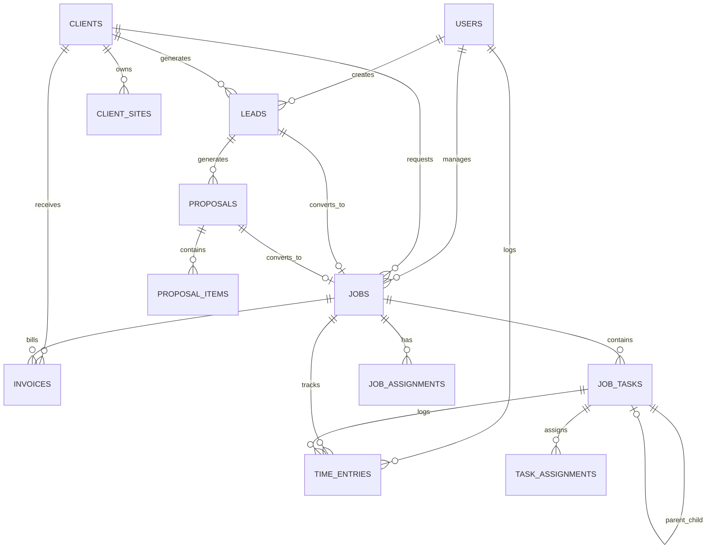

# Database Schema Documentation

This document provides a comprehensive overview of the Aluma database schema, relationships, and data models.

## Overview

The Aluma database is built on PostgreSQL via Supabase, featuring:

- **Row Level Security (RLS)** for data access control
- **Real-time subscriptions** for live updates
- **UUID primary keys** for all tables
- **Automatic timestamps** for audit trails
- **Foreign key constraints** for data integrity
- **Indexes** for optimal query performance

## Core Tables

### Users & Authentication

#### `users`

Central user management table linked to Supabase Auth.

```sql
CREATE TABLE users (
  id UUID DEFAULT gen_random_uuid() PRIMARY KEY,
  auth_user_id UUID UNIQUE REFERENCES auth.users(id) ON DELETE CASCADE,
  full_name TEXT NOT NULL,
  email TEXT UNIQUE NOT NULL,
  phone TEXT,
  role TEXT NOT NULL DEFAULT 'staff',
  active BOOLEAN DEFAULT true,
  created_at TIMESTAMPTZ DEFAULT NOW(),
  updated_at TIMESTAMPTZ DEFAULT NOW()
);
```

**Columns:**

- `id` - Internal user ID (UUID)
- `auth_user_id` - Links to Supabase auth.users table
- `full_name` - User's display name
- `email` - Unique email address
- `phone` - Optional phone number
- `role` - User role (admin, manager, technician, subcontractor, staff)
- `active` - Account status
- `created_at` - Account creation timestamp
- `updated_at` - Last modification timestamp

**Indexes:**

```sql
CREATE INDEX idx_users_auth_user_id ON users(auth_user_id);
CREATE INDEX idx_users_email ON users(email);
CREATE INDEX idx_users_role ON users(role);
```

#### `roles`

Role definitions for the RBAC system.

```sql
CREATE TABLE roles (
  id UUID DEFAULT gen_random_uuid() PRIMARY KEY,
  name TEXT UNIQUE NOT NULL,
  description TEXT,
  created_at TIMESTAMPTZ DEFAULT NOW()
);
```

#### `user_roles`

Many-to-many relationship for user role assignments.

```sql
CREATE TABLE user_roles (
  id UUID DEFAULT gen_random_uuid() PRIMARY KEY,
  user_id UUID REFERENCES users(id) ON DELETE CASCADE,
  role_id UUID REFERENCES roles(id) ON DELETE CASCADE,
  assigned_at TIMESTAMPTZ DEFAULT NOW(),
  UNIQUE(user_id, role_id)
);
```

### Client Management

#### `clients`

Customer and client information.

```sql
CREATE TABLE clients (
  id UUID DEFAULT gen_random_uuid() PRIMARY KEY,
  name TEXT NOT NULL,
  type TEXT CHECK (type IN ('business', 'residential')) DEFAULT 'residential',
  abn TEXT,
  address TEXT,
  suburb TEXT,
  state TEXT,
  postcode TEXT,
  phone TEXT,
  email TEXT,
  notes TEXT,
  status TEXT DEFAULT 'active',
  created_by UUID REFERENCES users(id),
  created_at TIMESTAMPTZ DEFAULT NOW(),
  updated_at TIMESTAMPTZ DEFAULT NOW()
);
```

**Business Rules:**

- Business clients can have ABN (Australian Business Number)
- Residential clients typically don't require ABN
- Status can be 'active', 'inactive', or 'archived'

#### `client_contacts`

Contact persons for client organizations.

```sql
CREATE TABLE client_contacts (
  id UUID DEFAULT gen_random_uuid() PRIMARY KEY,
  client_id UUID REFERENCES clients(id) ON DELETE CASCADE,
  full_name TEXT NOT NULL,
  email TEXT,
  phone TEXT,
  role TEXT,
  is_primary BOOLEAN DEFAULT false,
  created_at TIMESTAMPTZ DEFAULT NOW()
);
```

#### `client_sites`

Physical locations/properties for clients.

```sql
CREATE TABLE client_sites (
  id UUID DEFAULT gen_random_uuid() PRIMARY KEY,
  client_id UUID REFERENCES clients(id) ON DELETE CASCADE,
  site_name TEXT NOT NULL,
  address TEXT NOT NULL,
  suburb TEXT,
  state TEXT,
  postcode TEXT,
  lat DECIMAL(10,8),
  lng DECIMAL(11,8),
  access_notes TEXT,
  created_at TIMESTAMPTZ DEFAULT NOW()
);
```

**Features:**

- GPS coordinates for navigation
- Access notes for field workers
- Multiple sites per client support

### Sales Pipeline

#### `leads`

Sales opportunities and prospect tracking.

```sql
CREATE TABLE leads (
  id UUID DEFAULT gen_random_uuid() PRIMARY KEY,
  client_id UUID REFERENCES clients(id) ON DELETE SET NULL,
  name TEXT NOT NULL,
  description TEXT,
  status TEXT DEFAULT 'new' CHECK (status IN ('new', 'contacted', 'engaged', 'proposal_sent', 'won', 'lost')),
  source TEXT,
  value DECIMAL(12,2),
  probability INTEGER DEFAULT 50 CHECK (probability >= 0 AND probability <= 100),
  expected_close_date DATE,
  assigned_to UUID REFERENCES users(id),
  created_by UUID REFERENCES users(id),
  notes TEXT,
  created_at TIMESTAMPTZ DEFAULT NOW(),
  updated_at TIMESTAMPTZ DEFAULT NOW()
);
```

**Status Flow:**

```
new → contacted → engaged → proposal_sent → won/lost
```

**Indexes:**

```sql
CREATE INDEX idx_leads_status ON leads(status);
CREATE INDEX idx_leads_assigned_to ON leads(assigned_to);
CREATE INDEX idx_leads_created_by ON leads(created_by);
```

#### `lead_contacts`

Contact information specific to leads.

```sql
CREATE TABLE lead_contacts (
  id UUID DEFAULT gen_random_uuid() PRIMARY KEY,
  lead_id UUID REFERENCES leads(id) ON DELETE CASCADE,
  full_name TEXT NOT NULL,
  email TEXT,
  phone TEXT,
  role TEXT,
  created_at TIMESTAMPTZ DEFAULT NOW()
);
```

### Project Management

#### `jobs`

Active work projects and job orders.

```sql
CREATE TABLE jobs (
  id UUID DEFAULT gen_random_uuid() PRIMARY KEY,
  lead_id UUID REFERENCES leads(id) ON DELETE SET NULL,
  client_id UUID REFERENCES clients(id) ON DELETE SET NULL,
  site_id UUID REFERENCES client_sites(id) ON DELETE SET NULL,
  job_number TEXT UNIQUE NOT NULL,
  title TEXT NOT NULL,
  description TEXT,
  scope_of_works TEXT,
  status TEXT DEFAULT 'scheduled' CHECK (status IN ('scheduled', 'in_progress', 'completed', 'cancelled', 'on_hold')),
  priority TEXT DEFAULT 'medium' CHECK (priority IN ('low', 'medium', 'high', 'urgent')),
  scheduled_date DATE,
  start_date DATE,
  completion_date DATE,
  estimated_hours DECIMAL(8,2),
  actual_hours DECIMAL(8,2) DEFAULT 0,
  estimated_value DECIMAL(12,2),
  actual_cost DECIMAL(12,2) DEFAULT 0,
  created_by UUID REFERENCES users(id),
  project_manager UUID REFERENCES users(id),
  notes TEXT,
  created_at TIMESTAMPTZ DEFAULT NOW(),
  updated_at TIMESTAMPTZ DEFAULT NOW()
);
```

**Job Lifecycle:**

```
scheduled → in_progress → completed
           ↓
        on_hold → in_progress
           ↓
       cancelled
```

**Indexes:**

```sql
CREATE INDEX idx_jobs_status ON jobs(status);
CREATE INDEX idx_jobs_client_id ON jobs(client_id);
CREATE INDEX idx_jobs_scheduled_date ON jobs(scheduled_date);
CREATE INDEX idx_jobs_project_manager ON jobs(project_manager);
```

#### `job_assignments`

Staff assignments to jobs.

```sql
CREATE TABLE job_assignments (
  id UUID DEFAULT gen_random_uuid() PRIMARY KEY,
  job_id UUID REFERENCES jobs(id) ON DELETE CASCADE,
  user_id UUID REFERENCES users(id) ON DELETE CASCADE,
  assigned_role TEXT,
  hourly_rate DECIMAL(8,2),
  assigned_at TIMESTAMPTZ DEFAULT NOW(),
  assigned_by UUID REFERENCES users(id),
  UNIQUE(job_id, user_id)
);
```

### Task Management

#### `job_tasks`

Individual tasks within jobs.

```sql
CREATE TABLE job_tasks (
  id UUID DEFAULT gen_random_uuid() PRIMARY KEY,
  job_id UUID REFERENCES jobs(id) ON DELETE CASCADE,
  title TEXT NOT NULL,
  description TEXT,
  status TEXT DEFAULT 'pending' CHECK (status IN ('pending', 'in_progress', 'completed', 'blocked')),
  priority TEXT DEFAULT 'medium' CHECK (priority IN ('low', 'medium', 'high', 'urgent')),
  estimated_hours DECIMAL(8,2),
  actual_hours DECIMAL(8,2) DEFAULT 0,
  due_date DATE,
  completed_at TIMESTAMPTZ,
  created_by UUID REFERENCES users(id),
  sequence_order INTEGER DEFAULT 0,
  parent_task_id UUID REFERENCES job_tasks(id) ON DELETE SET NULL,
  notes TEXT,
  created_at TIMESTAMPTZ DEFAULT NOW(),
  updated_at TIMESTAMPTZ DEFAULT NOW()
);
```

**Features:**

- Hierarchical tasks with parent-child relationships
- Sequence ordering for task dependencies
- Individual time tracking per task

**Indexes:**

```sql
CREATE INDEX idx_job_tasks_job_id ON job_tasks(job_id);
CREATE INDEX idx_job_tasks_status ON job_tasks(status);
CREATE INDEX idx_job_tasks_due_date ON job_tasks(due_date);
```

#### `task_assignments`

Staff assignments to specific tasks.

```sql
CREATE TABLE task_assignments (
  id UUID DEFAULT gen_random_uuid() PRIMARY KEY,
  task_id UUID REFERENCES job_tasks(id) ON DELETE CASCADE,
  user_id UUID REFERENCES users(id) ON DELETE CASCADE,
  assigned_at TIMESTAMPTZ DEFAULT NOW(),
  assigned_by UUID REFERENCES users(id),
  UNIQUE(task_id, user_id)
);
```

### Time Tracking

#### `time_entries`

Time logging for billing and productivity tracking.

```sql
CREATE TABLE time_entries (
  id UUID DEFAULT gen_random_uuid() PRIMARY KEY,
  user_id UUID REFERENCES users(id) ON DELETE CASCADE,
  job_id UUID REFERENCES jobs(id) ON DELETE CASCADE,
  task_id UUID REFERENCES job_tasks(id) ON DELETE SET NULL,
  start_time TIMESTAMPTZ NOT NULL,
  end_time TIMESTAMPTZ,
  hours DECIMAL(8,2),
  description TEXT,
  billable BOOLEAN DEFAULT true,
  rate DECIMAL(8,2),
  created_at TIMESTAMPTZ DEFAULT NOW()
);
```

**Features:**

- Automatic hour calculation from start/end times
- Billable vs non-billable time tracking
- Hourly rate storage for billing
- Description for work performed

**Indexes:**

```sql
CREATE INDEX idx_time_entries_user_id ON time_entries(user_id);
CREATE INDEX idx_time_entries_job_id ON time_entries(job_id);
CREATE INDEX idx_time_entries_start_time ON time_entries(start_time);
```

### Proposals & Quotes

#### `proposals`

Formal quotes and proposals to clients.

```sql
CREATE TABLE proposals (
  id UUID DEFAULT gen_random_uuid() PRIMARY KEY,
  lead_id UUID REFERENCES leads(id) ON DELETE SET NULL,
  client_id UUID REFERENCES clients(id) ON DELETE CASCADE,
  proposal_number TEXT UNIQUE NOT NULL,
  title TEXT NOT NULL,
  description TEXT,
  status TEXT DEFAULT 'draft' CHECK (status IN ('draft', 'sent', 'viewed', 'accepted', 'rejected', 'expired')),
  version INTEGER DEFAULT 1,
  total_amount DECIMAL(12,2) NOT NULL DEFAULT 0,
  tax_amount DECIMAL(12,2) DEFAULT 0,
  valid_until DATE,
  created_by UUID REFERENCES users(id),
  sent_at TIMESTAMPTZ,
  viewed_at TIMESTAMPTZ,
  responded_at TIMESTAMPTZ,
  notes TEXT,
  terms_conditions TEXT,
  created_at TIMESTAMPTZ DEFAULT NOW(),
  updated_at TIMESTAMPTZ DEFAULT NOW()
);
```

**Proposal Lifecycle:**

```
draft → sent → viewed → accepted/rejected/expired
```

#### `proposal_items`

Line items within proposals.

```sql
CREATE TABLE proposal_items (
  id UUID DEFAULT gen_random_uuid() PRIMARY KEY,
  proposal_id UUID REFERENCES proposals(id) ON DELETE CASCADE,
  item_type TEXT DEFAULT 'service' CHECK (item_type IN ('service', 'material', 'labor')),
  description TEXT NOT NULL,
  quantity DECIMAL(10,3) DEFAULT 1,
  unit_price DECIMAL(12,2) NOT NULL,
  total_price DECIMAL(12,2) NOT NULL,
  sequence_order INTEGER DEFAULT 0,
  created_at TIMESTAMPTZ DEFAULT NOW()
);
```

### Billing & Invoicing

#### `invoices`

Financial invoicing for completed work.

```sql
CREATE TABLE invoices (
  id UUID DEFAULT gen_random_uuid() PRIMARY KEY,
  job_id UUID REFERENCES jobs(id) ON DELETE SET NULL,
  proposal_id UUID REFERENCES proposals(id) ON DELETE SET NULL,
  client_id UUID REFERENCES clients(id) ON DELETE CASCADE,
  invoice_number TEXT UNIQUE NOT NULL,
  status TEXT DEFAULT 'draft' CHECK (status IN ('draft', 'sent', 'paid', 'overdue', 'cancelled')),
  issue_date DATE NOT NULL,
  due_date DATE NOT NULL,
  subtotal DECIMAL(12,2) NOT NULL DEFAULT 0,
  tax_amount DECIMAL(12,2) DEFAULT 0,
  total_amount DECIMAL(12,2) NOT NULL DEFAULT 0,
  paid_amount DECIMAL(12,2) DEFAULT 0,
  created_by UUID REFERENCES users(id),
  sent_at TIMESTAMPTZ,
  paid_at TIMESTAMPTZ,
  notes TEXT,
  payment_terms TEXT,
  created_at TIMESTAMPTZ DEFAULT NOW(),
  updated_at TIMESTAMPTZ DEFAULT NOW()
);
```

**Invoice Lifecycle:**

```
draft → sent → paid/overdue
       ↓
   cancelled
```

## Entity Relationships

### Core Relationships Diagram



### Data Flow

1. **Lead Generation**

   ```
   Client → Lead → Proposal → Job
   ```

2. **Job Execution**

   ```
   Job → Tasks → Assignments → Time Tracking → Completion
   ```

3. **Billing Cycle**
   ```
   Completed Job → Invoice → Payment
   ```

## Constraints & Validations

### Check Constraints

```sql
-- Status validations
ALTER TABLE leads ADD CONSTRAINT leads_status_check
  CHECK (status IN ('new', 'contacted', 'engaged', 'proposal_sent', 'won', 'lost'));

ALTER TABLE jobs ADD CONSTRAINT jobs_status_check
  CHECK (status IN ('scheduled', 'in_progress', 'completed', 'cancelled', 'on_hold'));

-- Probability range
ALTER TABLE leads ADD CONSTRAINT leads_probability_check
  CHECK (probability >= 0 AND probability <= 100);

-- Date validations
ALTER TABLE jobs ADD CONSTRAINT jobs_dates_check
  CHECK (start_date >= scheduled_date);

ALTER TABLE invoices ADD CONSTRAINT invoices_dates_check
  CHECK (due_date >= issue_date);
```

### Foreign Key Policies

Most foreign keys use appropriate CASCADE or SET NULL policies:

- **CASCADE**: When parent is deleted, children are also deleted
- **SET NULL**: When parent is deleted, foreign key is set to null
- **RESTRICT**: Prevents deletion if children exist

## Triggers & Functions

### Automatic Timestamps

```sql
CREATE OR REPLACE FUNCTION update_updated_at_column()
RETURNS TRIGGER AS $$
BEGIN
    NEW.updated_at = NOW();
    RETURN NEW;
END;
$$ language 'plpgsql';

-- Apply to relevant tables
CREATE TRIGGER update_users_updated_at
  BEFORE UPDATE ON users
  FOR EACH ROW EXECUTE FUNCTION update_updated_at_column();
```

### Job Number Generation

```sql
CREATE OR REPLACE FUNCTION generate_job_number()
RETURNS TRIGGER AS $$
BEGIN
  IF NEW.job_number IS NULL THEN
    NEW.job_number := 'JOB-' || EXTRACT(YEAR FROM NOW()) || '-' ||
                      LPAD(nextval('job_number_seq')::TEXT, 3, '0');
  END IF;
  RETURN NEW;
END;
$$ language 'plpgsql';
```

### Calculated Fields

```sql
-- Update job actual hours from time entries
CREATE OR REPLACE FUNCTION update_job_hours()
RETURNS TRIGGER AS $$
BEGIN
  UPDATE jobs SET
    actual_hours = (
      SELECT COALESCE(SUM(hours), 0)
      FROM time_entries
      WHERE job_id = NEW.job_id
    )
  WHERE id = NEW.job_id;
  RETURN NEW;
END;
$$ language 'plpgsql';
```

## Row Level Security (RLS)

### User Access Policies

```sql
-- Users can view their own profile and admins can view all
CREATE POLICY "users_select_policy" ON users FOR SELECT USING (
  auth.uid() = auth_user_id OR
  EXISTS (SELECT 1 FROM users WHERE auth_user_id = auth.uid() AND role = 'admin')
);

-- Only admins can update user roles
CREATE POLICY "users_update_policy" ON users FOR UPDATE USING (
  EXISTS (SELECT 1 FROM users WHERE auth_user_id = auth.uid() AND role = 'admin')
);
```

### Data Access by Role

```sql
-- Jobs access based on role
CREATE POLICY "jobs_select_policy" ON jobs FOR SELECT USING (
  -- Admins and managers see all jobs
  EXISTS (SELECT 1 FROM users WHERE auth_user_id = auth.uid() AND role IN ('admin', 'manager'))
  OR
  -- Other users see assigned jobs
  EXISTS (SELECT 1 FROM job_assignments ja JOIN users u ON ja.user_id = u.id
          WHERE ja.job_id = jobs.id AND u.auth_user_id = auth.uid())
);
```

## Performance Optimization

### Key Indexes

```sql
-- Composite indexes for common queries
CREATE INDEX idx_jobs_status_scheduled_date ON jobs(status, scheduled_date);
CREATE INDEX idx_time_entries_user_date ON time_entries(user_id, start_time);
CREATE INDEX idx_tasks_job_status ON job_tasks(job_id, status);

-- Partial indexes for active records
CREATE INDEX idx_active_jobs ON jobs(status, scheduled_date)
  WHERE status IN ('scheduled', 'in_progress');

CREATE INDEX idx_pending_tasks ON job_tasks(job_id, due_date)
  WHERE status IN ('pending', 'in_progress');
```

### Query Optimization

Common query patterns and their optimizations:

1. **Dashboard KPIs**

   ```sql
   -- Use materialized views for complex aggregations
   CREATE MATERIALIZED VIEW dashboard_kpis AS
   SELECT
     COUNT(CASE WHEN status = 'in_progress' THEN 1 END) as active_jobs,
     COUNT(CASE WHEN status = 'pending' THEN 1 END) as pending_tasks,
     SUM(CASE WHEN status = 'paid' THEN total_amount ELSE 0 END) as monthly_revenue
   FROM jobs j
   LEFT JOIN job_tasks jt ON j.id = jt.job_id
   LEFT JOIN invoices i ON j.id = i.job_id
   WHERE j.created_at >= date_trunc('month', CURRENT_DATE);
   ```

2. **User Task Lists**
   ```sql
   -- Optimized query for user's assigned tasks
   SELECT jt.*, j.title as job_title, j.client_id
   FROM job_tasks jt
   JOIN jobs j ON jt.job_id = j.id
   JOIN task_assignments ta ON jt.id = ta.task_id
   JOIN users u ON ta.user_id = u.id
   WHERE u.auth_user_id = auth.uid()
     AND jt.status IN ('pending', 'in_progress')
   ORDER BY jt.due_date ASC NULLS LAST, jt.priority DESC;
   ```

## Backup & Maintenance

### Backup Strategy

```sql
-- Automated backups via Supabase
-- Point-in-time recovery available
-- Daily snapshots retained for 7 days
-- Weekly snapshots retained for 4 weeks
-- Monthly snapshots retained for 3 months
```

### Data Retention

```sql
-- Archive old time entries
DELETE FROM time_entries
WHERE created_at < NOW() - INTERVAL '2 years';

-- Archive completed jobs older than 1 year
UPDATE jobs SET status = 'archived'
WHERE status = 'completed'
  AND completion_date < NOW() - INTERVAL '1 year';
```

### Database Statistics

```sql
-- Update table statistics for query optimization
ANALYZE;

-- Vacuum to reclaim space
VACUUM ANALYZE;
```

## Migration Scripts

### Initial Schema

All initial tables are created by running:

```sql
-- Run mvp-essential-schema.sql
-- Run mvp-seed-data.sql (for demo data)
```

### Future Migrations

Migration scripts should follow this pattern:

```sql
-- Migration: Add invoice_items table
-- Date: 2024-02-01
-- Description: Separate invoice line items for better flexibility

BEGIN;

CREATE TABLE invoice_items (
  id UUID DEFAULT gen_random_uuid() PRIMARY KEY,
  invoice_id UUID REFERENCES invoices(id) ON DELETE CASCADE,
  description TEXT NOT NULL,
  quantity DECIMAL(10,3) DEFAULT 1,
  unit_price DECIMAL(12,2) NOT NULL,
  total_price DECIMAL(12,2) NOT NULL,
  created_at TIMESTAMPTZ DEFAULT NOW()
);

-- Update existing invoices to use line items
-- ... migration logic ...

COMMIT;
```

## Troubleshooting

### Common Issues

1. **Duplicate Key Errors**

   ```sql
   -- Check for existing records before insert
   INSERT INTO clients (name, email)
   VALUES ('New Client', 'email@example.com')
   ON CONFLICT (email) DO UPDATE SET name = EXCLUDED.name;
   ```

2. **RLS Policy Conflicts**

   ```sql
   -- Debug RLS policies
   SELECT * FROM pg_policies WHERE tablename = 'jobs';

   -- Temporarily disable RLS for debugging
   ALTER TABLE jobs DISABLE ROW LEVEL SECURITY;
   ```

3. **Performance Issues**

   ```sql
   -- Analyze slow queries
   EXPLAIN ANALYZE SELECT * FROM jobs WHERE status = 'in_progress';

   -- Check index usage
   SELECT schemaname, tablename, indexname, idx_scan, idx_tup_read, idx_tup_fetch
   FROM pg_stat_user_indexes
   WHERE schemaname = 'public'
   ORDER BY idx_scan DESC;
   ```

---

For database questions or schema changes, contact the development team or create an issue in the repository.
